# cscart-payment-sfepay
* Sfepay支付cscart插件使用说明
* 适用与Cs-cart 4.3.2，其他版本并未测试

## 安装方法
* Add-ons -> Manage add-ons -> 点击+
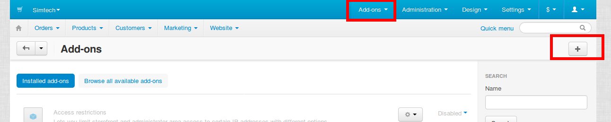
* Local -> 选择sfepay.tar.gz压缩包 -> 点击Upload & Install
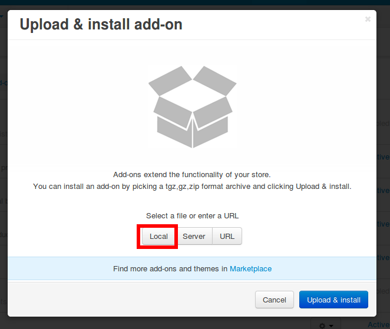
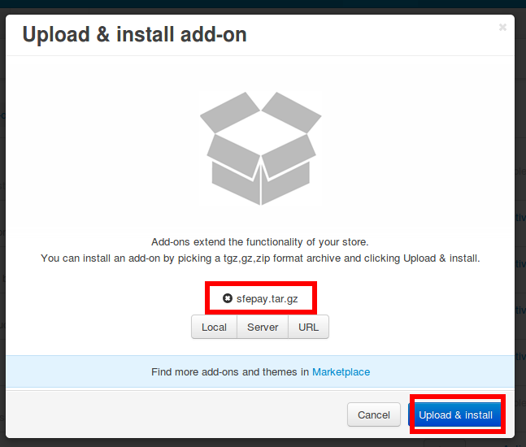
* Add-ons -> Manage add-ons -> Installed add-ons -> Sfepay -> 点击Active
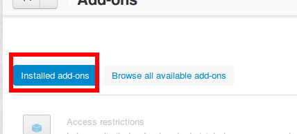
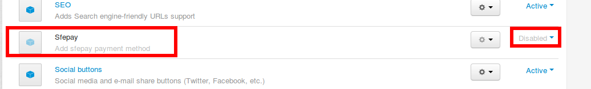
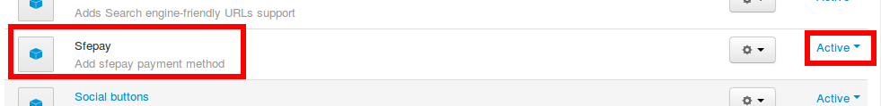

## 配置方法
* Administration -> Payment methods -> 点击+
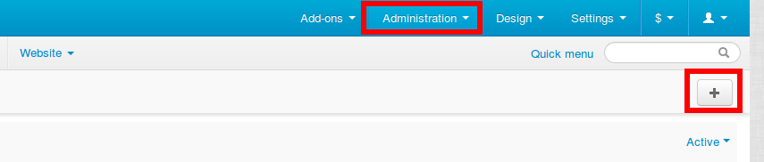
* 按照图中数据填好
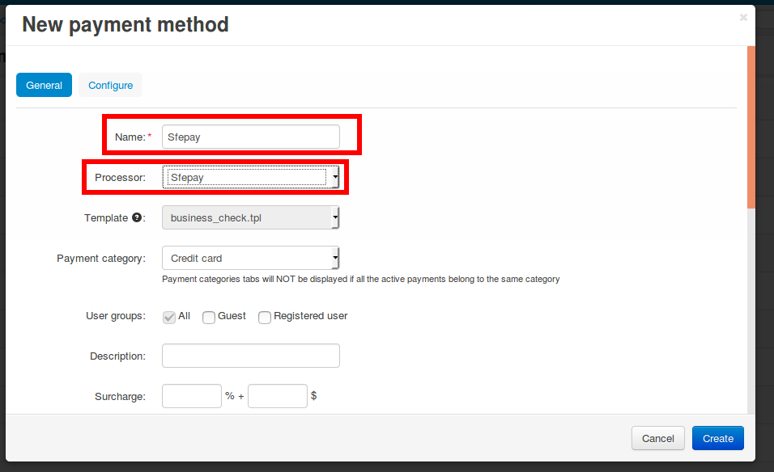
* 点击configure选项卡
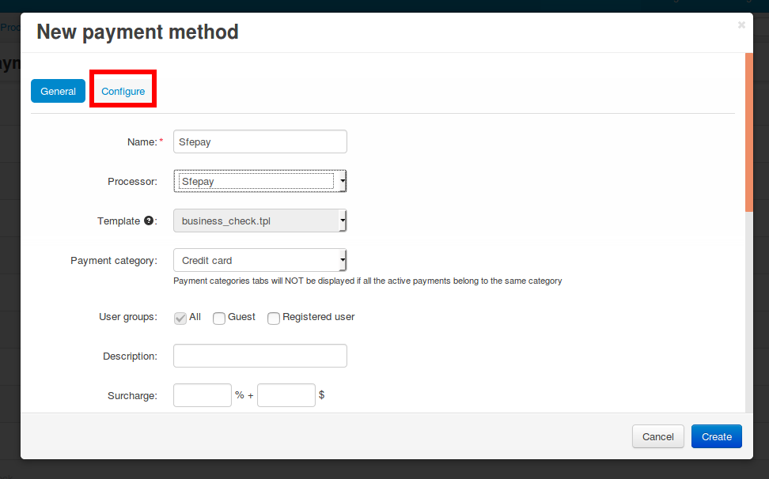
* 填入商户号和MD5Key，然后点击创建
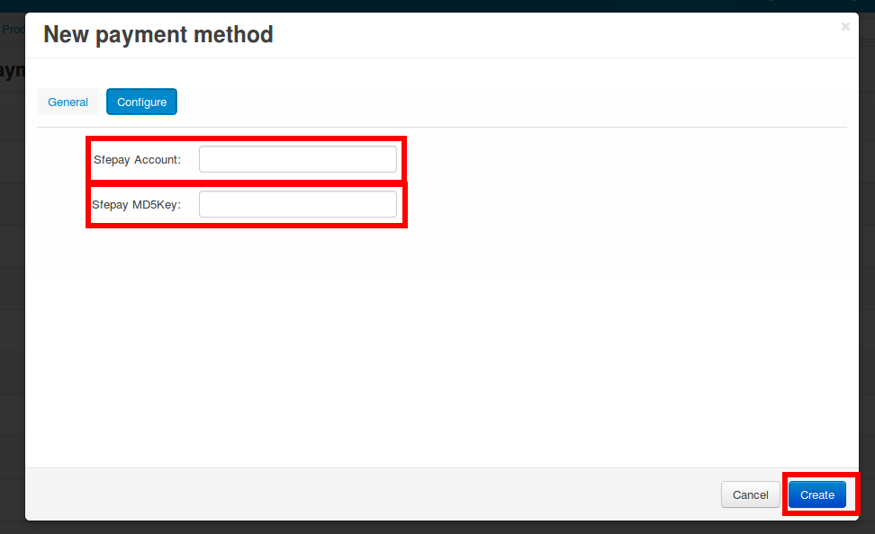

## 卸载方法
* Add-ons -> Manage add-ons -> Sfepay -> Uninstall
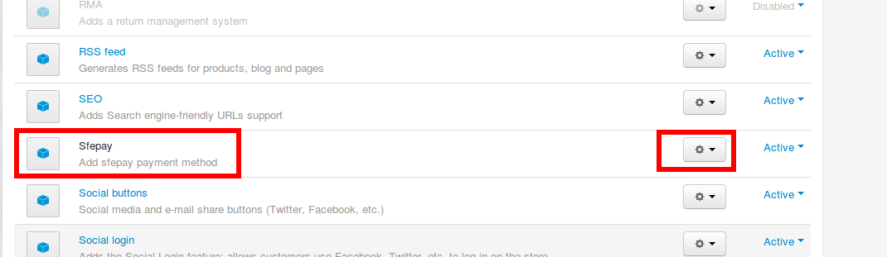
